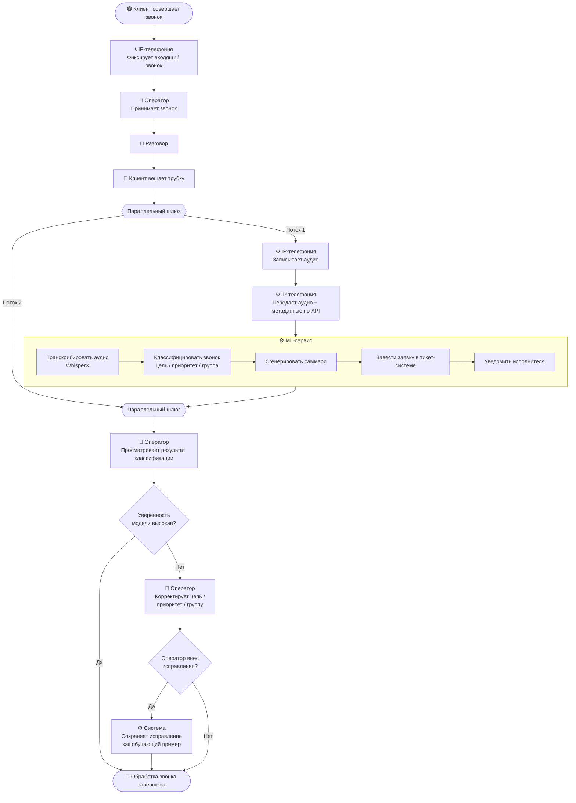

# BPMN: Обработка входящего звонка

```mermaid
flowchart TD
    Start([🟢 Клиент совершает звонок])
    T1["📞 IP-телефония\nФиксирует входящий звонок"]
    T2["👤 Оператор\nПринимает звонок"]
    T3["💬 Разговор"]
    T4["📵 Клиент вешает трубку"]

    GW_PAR_SPLIT{{Параллельный шлюз}}

    T5["⚙️ IP-телефония\nЗаписывает аудио"]
    T6["⚙️ IP-телефония\nПередаёт аудио + метаданные по API"]

    subgraph ML ["⚙️ ML-сервис"]
        ML1["Транскрибировать аудио\nWhisperX"]
        ML2["Классифицировать звонок\nцель / приоритет / группа"]
        ML3["Сгенерировать саммари"]
        ML4["Завести заявку в тикет-системе"]
        ML5["Уведомить исполнителя"]
        ML1 --> ML2 --> ML3 --> ML4 --> ML5
    end

    GW_PAR_JOIN{{Параллельный шлюз}}
    T7["👤 Оператор\nПросматривает результат классификации"]

    GW_CONF{Уверенность\nмодели высокая?}

    T8["👤 Оператор\nКорректирует цель /\nприоритет / группу"]
    GW_CORR{Оператор внёс\nисправления?}
    T9["⚙️ Система\nСохраняет исправление\nкак обучающий пример"]

    End([🔴 Обработка звонка завершена])

    Start --> T1 --> T2 --> T3 --> T4 --> GW_PAR_SPLIT
    GW_PAR_SPLIT -->|Поток 1| T5 --> T6 --> ML
    GW_PAR_SPLIT -->|Поток 2| GW_PAR_JOIN
    ML --> GW_PAR_JOIN
    GW_PAR_JOIN --> T7 --> GW_CONF

    GW_CONF -->|Да| End
    GW_CONF -->|Нет| T8 --> GW_CORR

    GW_CORR -->|Да| T9 --> End
    GW_CORR -->|Нет| End
```
