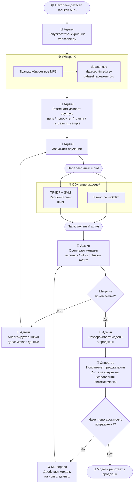

# BPMN: Подготовка датасета и обучение модели

```mermaid
flowchart TD
    Start([🟢 Накоплен датасет звонков MP3])

    T1["👤 Админ\nЗапускает транскрипцию\ntranscribe.py"]

    subgraph WX ["⚙️ WhisperX"]
        WX1["Транскрибирует все MP3"]
        WX2["dataset.csv\ndataset_timed.csv\ndataset_speakers.csv"]
        WX1 --> WX2
    end

    T2["👤 Админ\nРазмечает датасет вручную\nцель / приоритет / группа / is_training_sample"]
    T3["👤 Админ\nЗапускает обучение"]

    GW_TRAIN{{Параллельный шлюз}}

    subgraph MODELS ["⚙️ Обучение моделей"]
        M1["Fine-tune ruBERT"]
        M2["TF-IDF + SVM\nRandom Forest\nKNN"]
    end

    GW_JOIN{{Параллельный шлюз}}
    T4["👤 Админ\nОценивает метрики\naccuracy / F1 / confusion matrix"]
    GW_METRICS{Метрики\nприемлемые?}

    T5["👤 Админ\nАнализирует ошибки\nДоразмечает данные"]
    T6["👤 Админ\nРазворачивает модель\nв продакшн"]

    T7["👤 Оператор\nИсправляет предсказания\nСистема сохраняет исправления автоматически"]
    GW_DATA{Накоплено достаточно\nисправлений?}

    T8["⚙️ ML-сервис\nДообучает модель\nна новых данных"]

    End([🔴 Модель работает в продакшн])

    Start --> T1 --> WX --> T2 --> T3 --> GW_TRAIN
    GW_TRAIN --> M1
    GW_TRAIN --> M2
    M1 --> GW_JOIN
    M2 --> GW_JOIN
    GW_JOIN --> T4 --> GW_METRICS

    GW_METRICS -->|Нет| T5 --> T3
    GW_METRICS -->|Да| T6 --> T7 --> GW_DATA

    GW_DATA -->|Да| T8 --> T4
    GW_DATA -->|Нет| End
```
