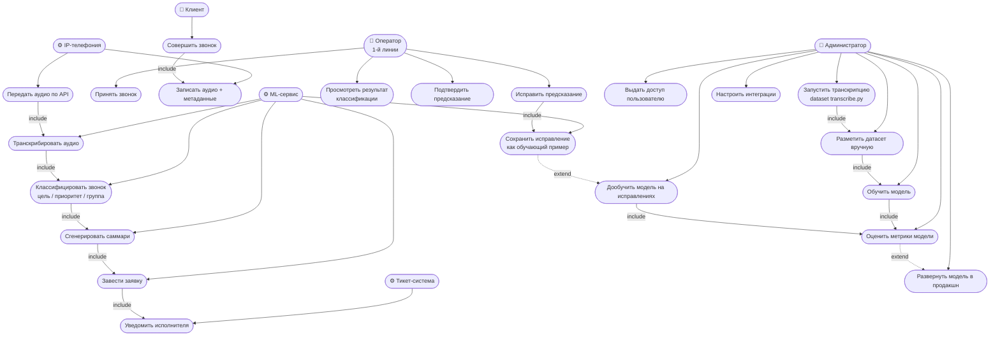

# Use-Case диаграмма

```mermaid
graph TD
    Client(["👤 Клиент"])
    Operator(["👤 Оператор\n1-й линии"])
    Admin(["👤 Администратор"])
    Telephony(["⚙️ IP-телефония"])
    ML(["⚙️ ML-сервис"])
    Tickets(["⚙️ Тикет-система"])

    UC1(["Совершить звонок"])
    UC2(["Принять звонок"])
    UC3(["Записать аудио + метаданные"])
    UC4(["Передать аудио по API"])
    UC5(["Транскрибировать аудио"])
    UC6(["Классифицировать звонок\nцель / приоритет / группа"])
    UC7(["Сгенерировать саммари"])
    UC8(["Завести заявку"])
    UC9(["Уведомить исполнителя"])
    UC10(["Просмотреть результат\nклассификации"])
    UC11(["Подтвердить предсказание"])
    UC12(["Исправить предсказание"])
    UC13(["Сохранить исправление\nкак обучающий пример"])
    UC14(["Выдать доступ пользователю"])
    UC15(["Запустить транскрипцию\ndataset transcribe.py"])
    UC16(["Разметить датасет вручную"])
    UC17(["Обучить модель"])
    UC18(["Оценить метрики модели"])
    UC19(["Развернуть модель в продакшн"])
    UC20(["Дообучить модель на исправлениях"])
    UC21(["Настроить интеграции"])

    Client --> UC1
    Operator --> UC2
    Operator --> UC10
    Operator --> UC11
    Operator --> UC12
    Telephony --> UC3
    Telephony --> UC4
    ML --> UC5
    ML --> UC6
    ML --> UC7
    ML --> UC8
    ML --> UC13
    Tickets --> UC9
    Admin --> UC14
    Admin --> UC15
    Admin --> UC16
    Admin --> UC17
    Admin --> UC18
    Admin --> UC19
    Admin --> UC20
    Admin --> UC21

    UC1 -->|include| UC3
    UC4 -->|include| UC5
    UC5 -->|include| UC6
    UC6 -->|include| UC7
    UC7 -->|include| UC8
    UC8 -->|include| UC9
    UC12 -->|include| UC13
    UC13 -.->|extend| UC20
    UC15 -->|include| UC16
    UC16 -->|include| UC17
    UC17 -->|include| UC18
    UC18 -.->|extend| UC19
    UC20 -->|include| UC18
```
